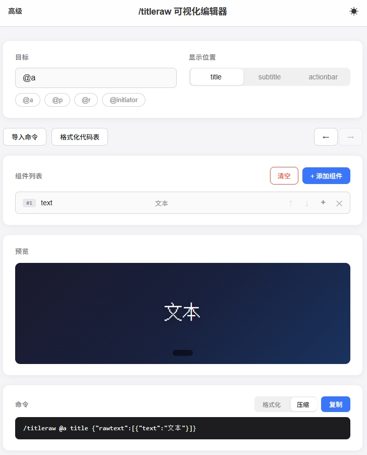

# /titleraw 可视化编辑器

一个简洁的 `/titleraw` 命令可视化编辑器网页，适用于 Minecraft 基岩版。

> 代码100%由AI生成丨MIT License丨V1.0



## 功能

- **基础功能完备**：支持添加、删除、编辑、排序组件。可使用 `text` / `selector` / `score` / `translate` 全类型。
- **translate支持**：可使用 with 参数添加 rawtext 数组，最多支持3层嵌套。
- **格式化代码表**：支持全部基岩版格式化代码，点击卡片即可复制对应编码。
- **其他**：还有命令导入、深色主题、实时预览等等。

## 使用

在线使用：点击[这里](https://cosep0127.github.io/TitlerawEditor/)或简介下方的链接即可。

## 项目结构

```text
├── index.html       页面骨架
├── style.css        样式（含深色模式变量）
├── constants.js     颜色数据与格式化编码映射
├── utils.js         工具函数（ID 生成、防抖）
├── dom.js           DOM 引用
├── state.js         应用状态、撤销/重做、localStorage
├── parser.js        命令/JSON 解析与导入
├── generator.js     命令生成
├── preview.js       格式化文本解析与视觉预览
├── components.js    组件列表渲染
├── ui.js            弹窗、提示、颜色参考卡、添加/编辑组件界面
└── main.js          入口（DOM 引用、事件绑定、初始化）
```

## 参考项目

* [小舟工具箱](https://github.com/lonzov/LonzovTool/) - 部分 UI 布局参考此项目“T显可视化编辑器”功能。